  

  

---

  

---

<h2>🧭Pyrrhus's Programming Journey</h2>

<!-- DYNAMIC_START -->
### 💡 Daily Tech Byte
> Debugging: Removing the needles from the haystack.

### 🕒 System Synchronized
- **Uptime:** Active 24/7 (via Actions)
- **Time:** `Sun, 14 Jun 2026 13:02:36 GMT`
<!-- DYNAMIC_END -->
